# nginx_ansible_automation
Projekt zaliczeniowy z przedmiotu "Administracja serwerowymi systemami operacyjnymi"

---
title: "[]{#_9l17l669jnw8 .anchor}Automatyzacja instalacji serwera
  webowego na wirtualnych maszynach"
---

## 

## 

## 

## 

## 

## 

## 

## 

## 

## 

## 

## 

## 

## 

**Adam Palacz**

## **Spis treści** 

**[Wstęp teoretyczny](#wstęp-teoretyczny) 3**

> [Ansible](#ansible) 3
>
> [Docker](#docker) 3
>
> [Ubuntu Server](#ubuntu-server) 3
>
> [Wirtualizacja](#wirtualizacja) 4
>
> [Python](#python) 4
>
> [GitLab](#gitlab) 4
>
> [Nginx](#nginx) 5

**[Wymagania wybranego systemu:](#wymagania-wybranego-systemu) 5**

**[Opis rozwiązań](#opis-rozwiązań) 5**

**[Przebieg tworzenia projektu](#przebieg-tworzenia-projektu) 6**

> [Utworzenie wirtualnych maszyn Ubuntu
> Server](#utworzenie-wirtualnych-maszyn-ubuntu-server) 6
>
> [Konfiguracja z GitLab](#konfiguracja-z-gitlab) 8
>
> [Konfiguracja Ansible](#konfiguracja-ansible) 8
>
> [Budowa automatyzacji dla maszyn z użyciem
> Ansible](#budowa-automatyzacji-dla-maszyn-z-użyciem-ansible) 10
>
> [Test całej automatyzacji](#test-całej-automatyzacji) 20

**[Bibliografia](#bibliografia) 23**

## 

## 

## Wstęp teoretyczny

#### **Ansible**

Ansible to otwarte oprogramowanie do zarządzania stanem infrastruktury
oraz do automatyzacji procesów administracyjnych w przedsiębiorstwie.
Ułatwia wdrażanie systemów i aplikacji, ich konfigurację, utrzymanie, a
także orkiestrację wewnątrz usług dzięki współdzielonym elementom
infrastruktury.

Ansible pozwala zarządzać setkami czy nawet tysiącami systemów naraz --
tak jak jednym. Dzięki temu można skonfigurować nawet pojedynczą usługę
zainstalowaną na wielu systemach. Zapewnia oszczędność czasu oraz
eliminuje problemy związane z ręczną konfiguracją usług. Pomaga także w
utrzymaniu środowiska w zgodności ze wszelkimi normami bezpieczeństwa.
Dzięki skalowalności i wieloplatformowości umożliwia efektywne
wykorzystanie zasobów z wszelkiego typu hostów. Warto zauważyć, iż
Ansible pozwala zarządzać zarówno systemami Linux, BSD, jak i Windows.
\[1\]

#### **Docker**

Otwarte oprogramowanie służące do realizacji wirtualizacji na poziomie
systemu operacyjnego (tzw. „konteneryzacji"), działające jako „platforma
dla programistów i administratorów do tworzenia, wdrażania i
uruchamiania aplikacji rozproszonych".

Docker jest określany jako narzędzie, które pozwala umieścić program
oraz jego zależności (biblioteki, pliki konfiguracyjne, lokalne bazy
danych itp.) w lekkim, przenośnym, wirtualnym kontenerze, który można
uruchomić na prawie każdym serwerze z systemem Linux. Kontenery wraz z
zawartością działają niezależnie od siebie i nie wiedzą o swoim
istnieniu. Mogą się jednak ze sobą komunikować w ramach ściśle
zdefiniowanych kanałów wymiany informacji. Dzięki uruchamianiu na jednym
wspólnym systemie operacyjnym, konteneryzacja jest lżejszym (mniej
zasobochłonnym) sposobem wirtualizacji niż pełna wirtualizacja lub
parawirtualizacja za pomocą wirtualnych systemów operacyjnych. \[2\]

#### **Ubuntu Server**

Darmowa dystrybucja GNU/Linuksa bazująca na Debianie. Przeznaczona jest
do zastosowań serwerowych. Po instalacji może zawierać pakiety serwera
email, WWW, DNS, baz danych i wielu innych. Instalacja odbywa się w
trybie tekstowym. Jest projektem rozwijanym obok Ubuntu, od którego
różni się konfiguracją oraz pakietami zainstalowanymi po instalacji.

Wydawana jest regularnie co pół roku (cykl wydawniczy identyczny jak w
przypadku wersji desktopowej), z wydaniami LTS (ang. Long Term Support
-- o przedłużonym wsparciu) co dwa lata. \[3\]

#### **Wirtualizacja**

Wirtualizacja polega na uruchomieniu za pomocą narzędzia wirtualizacji
(hypervisora, np. VirtualBox, VMware) systemu operacyjnego wewnątrz już
istniejącego. System zainstalowany na komputerze fizycznym zwany jest
gospodarzem (host), zaś systemy uruchomione na maszynach wirtualnych
nazywane są gośćmi (guests). Dzięki wirtualizacji otrzymujemy systemy
pracujące jednocześnie na tej samej fizycznej maszynie, która rozdziela
zasoby sprzętowe (pamięć operacyjna RAM, pamięć masowa, czas procesora)
gościom według ich potrzeb. Tak więc, stworzenie odseparowanego domowego
środowiska wirtualnego okazuje się wyjątkowo proste i dostępne dla
każdego, nawet mniej zaawansowanego użytkownika. \[4\]

#### **Python** 

Język programowania wysokiego poziomu ogólnego przeznaczenia, o
rozbudowanym pakiecie bibliotek standardowych, którego ideą przewodnią
jest czytelność i klarowność kodu źródłowego. Jego składnia cechuje się
przejrzystością i zwięzłością.

Python wspiera różne paradygmaty programowania: obiektowy, imperatywny
oraz w mniejszym stopniu funkcyjny. Posiada w pełni dynamiczny system
typów i automatyczne zarządzanie pamięcią, będąc w tym podobnym do
języków Perl, Ruby, Scheme czy Tcl. Podobnie jak inne języki dynamiczne
jest często używany jako język skryptowy. Interpretery Pythona są
dostępne na wiele systemów operacyjnych.

Python rozwijany jest jako projekt Open Source zarządzany przez Python
Software Foundation, która jest organizacją non-profit. Standardową
implementacją języka jest CPython (napisany w C), ale istnieją też inne,
np. Jython (napisany w Javie), CLPython napisany w Common Lisp,
IronPython (na platformę .NET) i PyPy. \[5\]

#### **GitLab**

Hostingowy serwis internetowy przeznaczony dla projektów
programistycznych oparty o system kontroli wersji Git oraz
otwartoźródłowe oprogramowanie, stworzone przez Dmitrija Zaporozhets,
których obecnie właścicielem jest GitLab Inc. Serwis umożliwia bezpłatne
wykorzystanie usługi lub zainstalowanie samodzielnie zarządzanego
oprogramowania wraz z opcjonalnymi, płatnymi planami. Usługa jest jedną
z najpopularniejszych tego typu na rynku, z której korzystają takie
firmy, jak IBM, Sony, NASA, Oracle, GNOME Foundation, NVIDIA, czy
SpaceX.

Usługa oprócz repozytoriów opartych na systemie kontroli wersji oferuje
także platformę dla metodyki DevOps oraz CI/CD.

Oprogramowanie serwisu GitLab zostało stworzone w języku Ruby (Ruby on
Rails), a wygląd serwisu w języku JavaScript (Vue.js). \[6\]

#### **Nginx**

Serwer WWW (HTTP) oraz serwer proxy dla HTTP i IMAP/POP3 stworzony przez
Igora Sysojewa a rozwijany i wspierany przez założoną przez niego firmę,
Nginx, Inc.

Zaprojektowany z myślą o wysokiej dostępności i silnie obciążonych
serwisach (nacisk na skalowalność i niską zajętość zasobów). Wydawany
jest na licencji BSD. \[7\]

## Wymagania wybranego systemu:

-   Wirtualne Maszyny Ubuntu Server każda po 20 GB (może być 8).

-   Maszyna master z Ansible 8 GB RAM (może być 4-6 GB), reszta po 2 GB.

-   Każda maszyna posiada dwie karty sieciowe: NAT i mostkowa

-   Na każdej maszynie musi zostać zainstalowany Python w wersji 3

-   Na maszynie master musi zostać zainstalowany Ansible

-   Na każdej maszynie musi zostać zainstalowane SSH

-   Na każdej maszynie powinno ustawić się statyczne IP dla sieci
    > mostkowej

## Opis rozwiązań

Projekt ma na celu zautomatyzowanie tworzenia serwerów webowych nginx
pomiędzy osobnymi wirtualnymi maszynami wraz z wykorzystaniem load
balancingu i konteneryzacji. Automatyzacja polega na stworzeniu
infrastruktury z wykorzystaniem Ansible pozwalającym na instalowanie i
konfigurowanie oprogramowania na wyznaczonych maszynach. Na każdej
maszynie aktualizowany jest system, instalowanego oprogramowania nginx i
docker oraz odpowiednio konfigurowane. W ramach projektu utworzone
zostaną serwery wraz z odpowiednimi adresami DNS. Usługa load balancingu
została użyta przy pomocy kontenerów z oprogramowaniem Apache HTTPD
pomiędzy którymi rozłożone są zapytania http. Dodatkowo można zamiast
dokera zastosować narzędzie kubernetes które pozwala na dodatkowe
rozwinięte zarządzanie kontenerami. Projekt pozwala na dowolne dodawanie
kolejnych wirtualnych maszyn dołączanie ich do procesu load balancingu.

## 

## 

## Przebieg tworzenia projektu

#### **Utworzenie wirtualnych maszyn Ubuntu Server**

-   1 maszyna master i 2 maszyny slave

-   Ustawienie dwie karty sieciowe dla każdej NAT i bridge

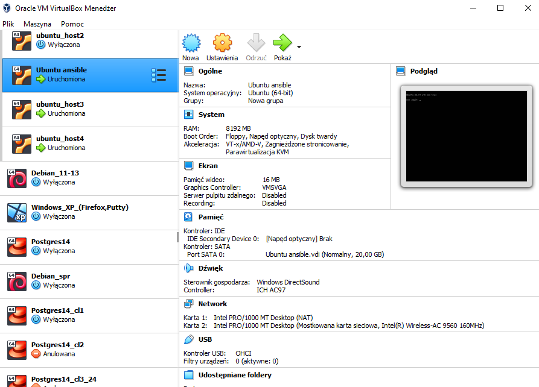{width="6.267716535433071in"
height="4.5in"}

-   Standardowa instalacja maszyn, aktualizacja systemu i instalacja ssh

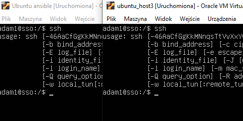{width="5.083333333333333in"
height="2.53125in"}

-   Ustawienie statycznego IP dla sieci bridge

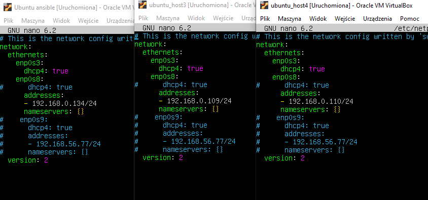{width="6.267716535433071in"
height="2.9305555555555554in"}

-   Instalacja Pythona na wirtualnych maszynach

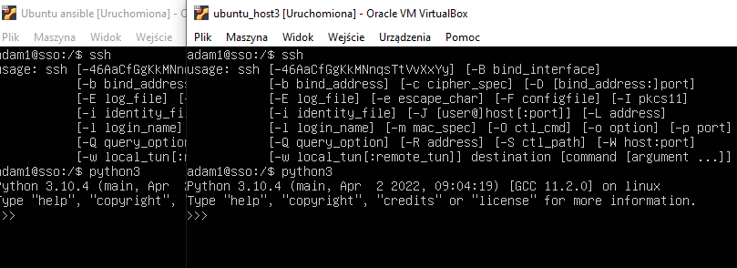{width="6.267716535433071in"
height="2.2777777777777777in"}

-   Instalacja Ansible na maszynie master

#### **Konfiguracja z GitLab**

-   Utworzenie repozytorium

-   Ustawienie dostępu za pomocą SSH

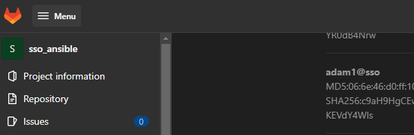{width="6.267716535433071in"
height="2.0416666666666665in"}

#### **Konfiguracja Ansible**

-   Przesłanie klucza ssh z Hosta na maszyny wirtualne

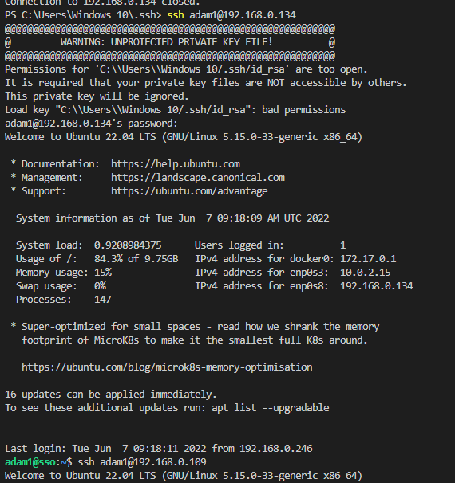{width="5.9375in"
height="6.3125in"}

-   Połączenie do maszyny master przy użyciu Remote SSH w Visual Studio
    > Code

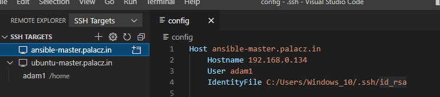{width="6.267716535433071in"
height="1.3888888888888888in"}

-   Pobranie repozytorium z GitLab

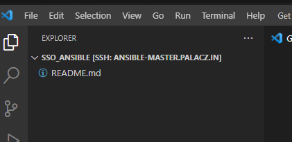{width="4.385416666666667in"
height="2.1354166666666665in"}

-   Konfiguracja maszyn w pliku Ansible

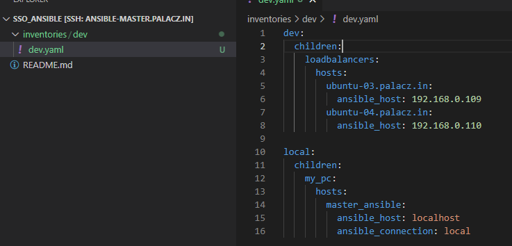{width="6.267716535433071in"
height="3.013888888888889in"}

-   Sprawdzenie połączenia z maszynami

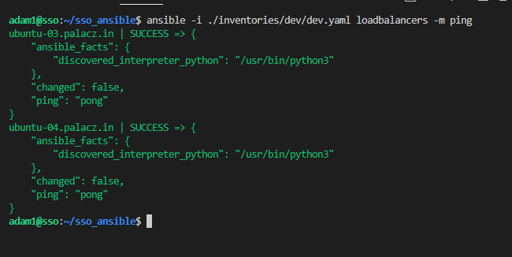{width="6.267716535433071in"
height="3.138888888888889in"}

#### **Budowa automatyzacji dla maszyn z użyciem Ansible**

-   Aktualizacja systemu

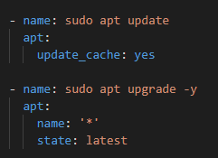{width="2.5104166666666665in"
height="1.8229166666666667in"}

-   Instalacja nginx i lynx

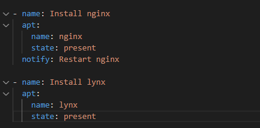{width="4.5in"
height="2.21875in"}

-   Wyślij na slave'y pliki konfiguracyjne nginx i utwórz linki z
    > sites-available do sites-enable

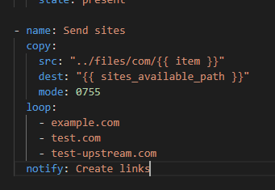{width="3.5520833333333335in"
height="2.4479166666666665in"}

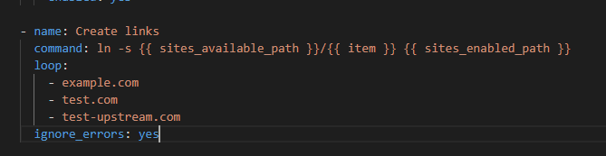{width="6.267716535433071in"
height="1.625in"}

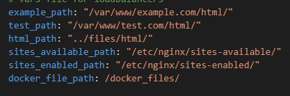{width="4.34375in"
height="1.4375in"}

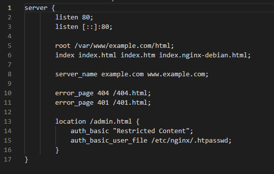{width="5.71875in"
height="3.6354166666666665in"}

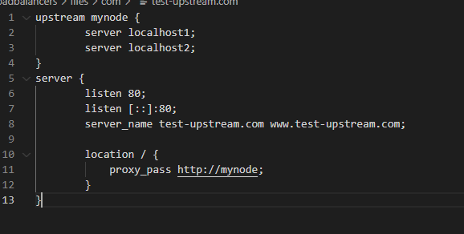{width="6.020833333333333in"
height="3.0416666666666665in"}

*(plik test.com jest taki sam jak example.com, natomiast test-upstream
będzie wykorzystany do load balancigu z użyciem dockera)*

-   Dodajemy adresy dns do pliku host na maszynach

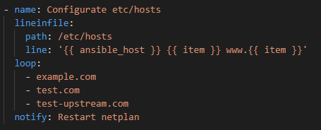{width="4.739583333333333in"
height="1.9166666666666667in"}

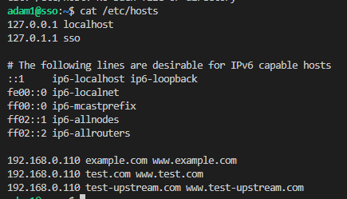{width="4.53125in"
height="2.59375in"}

-   Tworzymy foldery dla adresów i przesyłamy do nich pliki html

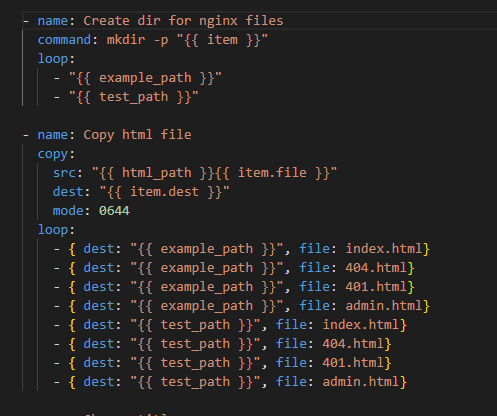{width="5.177083333333333in"
height="4.333333333333333in"}

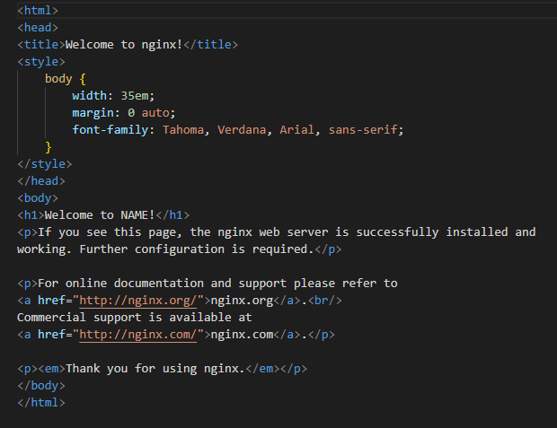{width="6.267716535433071in"
height="4.819444444444445in"}

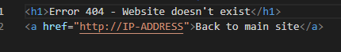{width="4.479166666666667in"
height="0.6875in"}

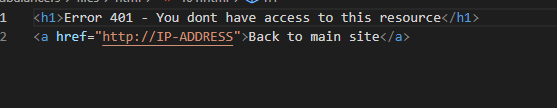{width="5.802083333333333in"
height="1.125in"}

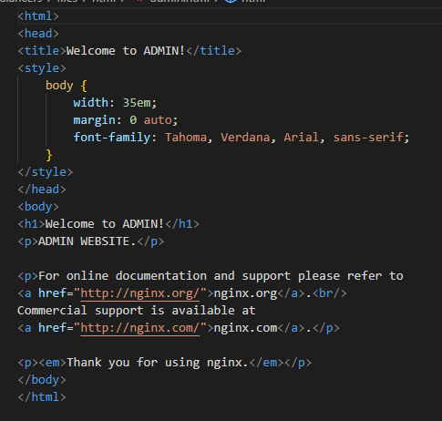{width="5.052083333333333in"
height="4.8125in"}

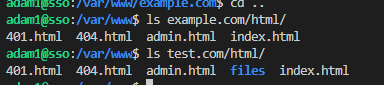{width="4.0in"
height="0.8854166666666666in"}

-   Zmieniamy wartości w plikach html w zależności od tego na którym
    > slave plik się znajduje

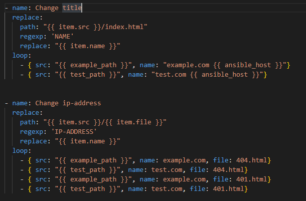{width="6.267716535433071in"
height="4.125in"}

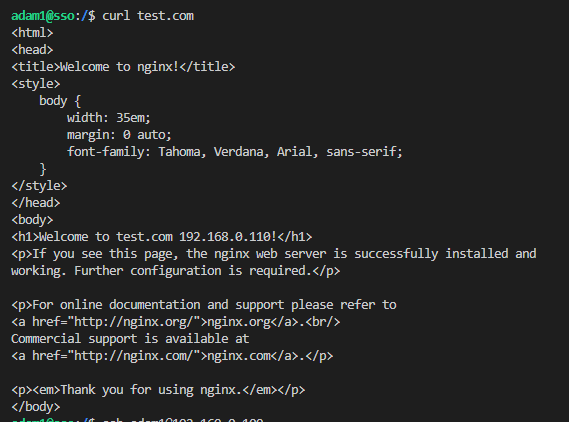{width="5.927083333333333in"
height="4.395833333333333in"}

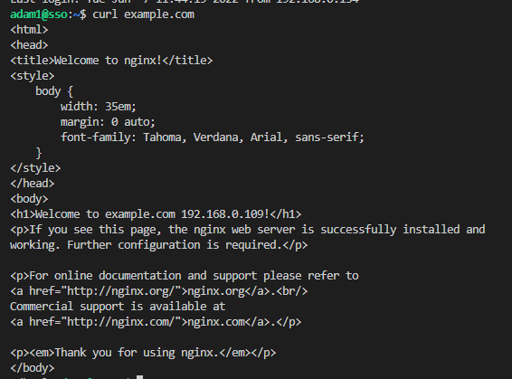{width="5.895833333333333in"
height="4.364583333333333in"}

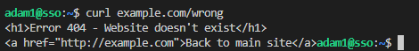{width="4.895833333333333in"
height="0.6041666666666666in"}

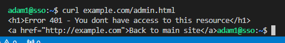{width="4.96875in"
height="0.7604166666666666in"}

-   Instalacja curl i docker

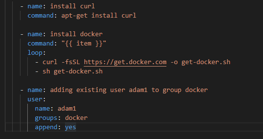{width="5.614583333333333in"
height="2.9583333333333335in"}

-   Uruchamiany kontenery docker z usługą apache httpd.

-   Przesyłamy na maszyny plik index.html.

-   Podmieniamy adresy dla naszego load balancera na adresy maszyn z
    > portami kontenerów.

-   Restartujemy nginx

-   Podmieniamy w plikach index.html informacje IP na temat aktualnej
    > maszyny

-   Kopiujemy plik do kontenerów

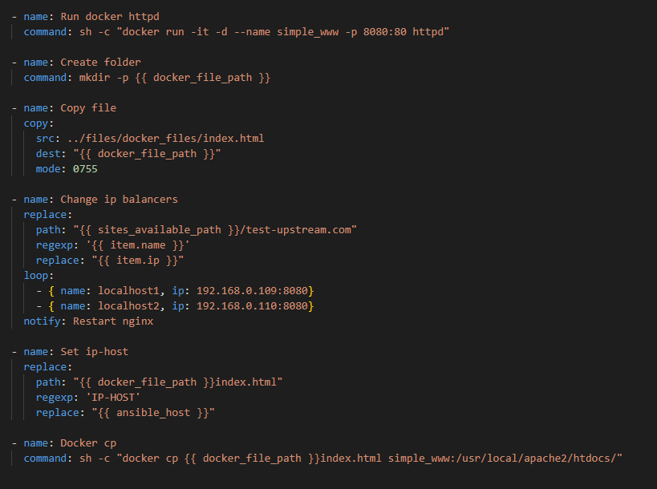{width="5.786458880139983in"
height="4.306201881014873in"}

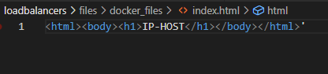{width="4.333333333333333in"
height="0.9791666666666666in"}

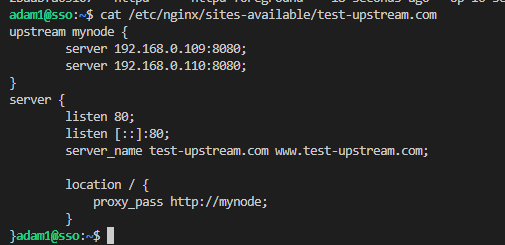{width="5.260416666666667in"
height="2.5520833333333335in"}

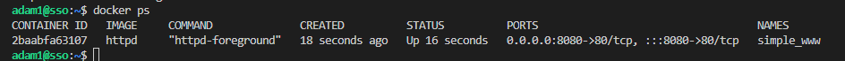{width="6.267716535433071in"
height="0.4583333333333333in"}

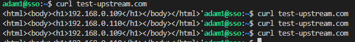{width="6.267716535433071in"
height="0.7638888888888888in"}

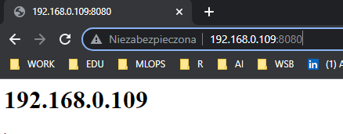{width="4.5625in"
height="1.78125in"}

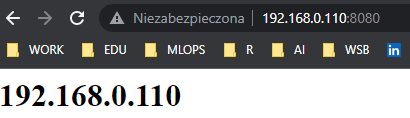{width="4.270833333333333in"
height="1.2291666666666667in"}

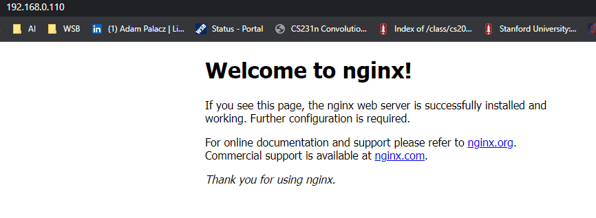{width="6.267716535433071in"
height="2.2916666666666665in"}

*( Na hoście mamy tylko dostęp do aplikacji bez wykorzystanych DNS. Żeby
mieć do nich dostęp należałoby zmiany dokonać na plikach defaultowych
nginx)*

#### **Test całej automatyzacji** 

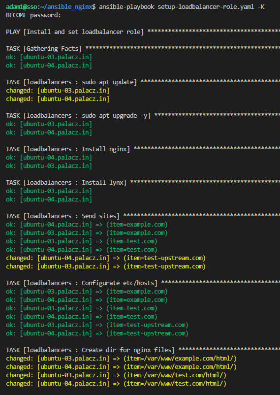{width="5.927083333333333in"
height="8.354166666666666in"}

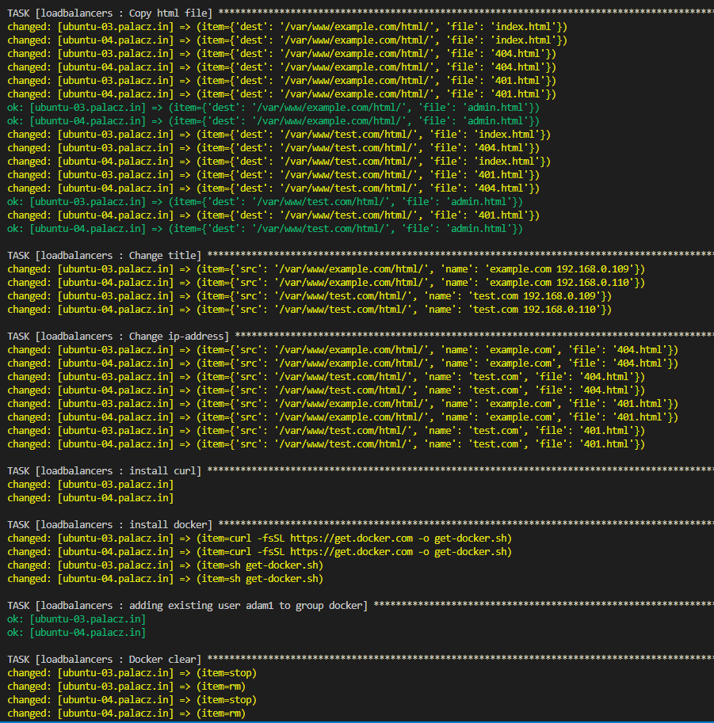{width="6.267716535433071in"
height="6.347222222222222in"}

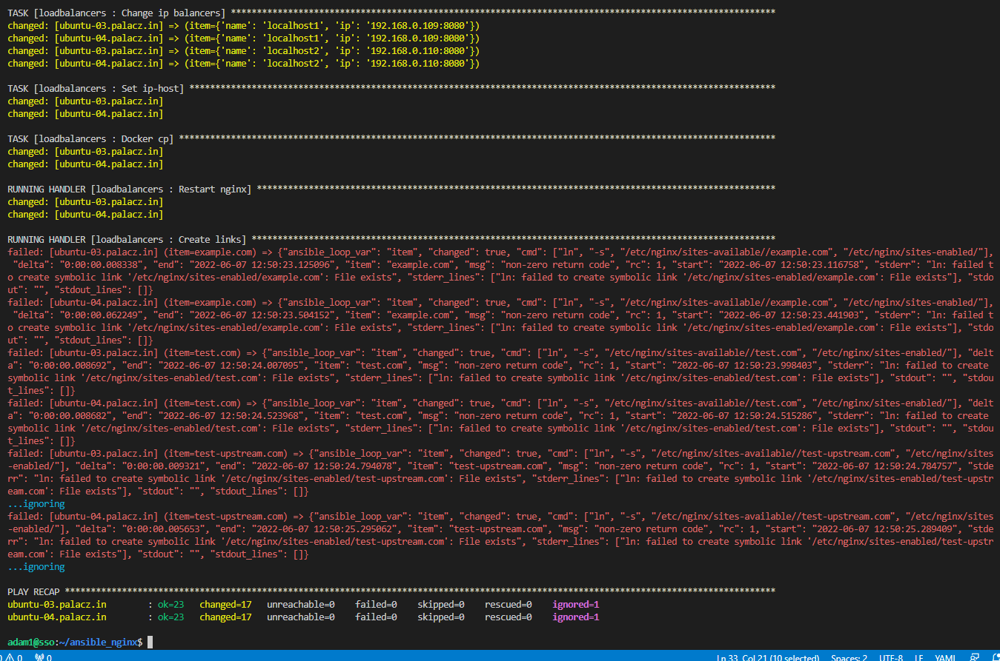{width="6.267716535433071in"
height="4.152777777777778in"}

Automatyzacja działa, jedynie występuje błąd przy tworzeniu linków z
site-available do site-enable ponieważ linki już istniały. Z tego powodu
uwzględniono ignorowanie tego błędu.

## 

## 

## 

## 

## 

## 

## Bibliografia

1.  Wstęp do Ansible. Eurolinux.
    > https://pl.euro-linux.com/eurotower/wstep-do-ansible/

2.  Docker. Wikipedia.
    > https://pl.wikipedia.org/wiki/Docker\_(oprogramowanie)

3.  Ubuntu Server Edition. Wikipedia
    > https://pl.wikipedia.org/wiki/Ubuntu_Server_Edition

4.  Wirtualizacja systemu operacyjnego. Pure PC.
    > https://www.purepc.pl/wirtualizacja-systemu-operacyjnego-poradnik-dla-poczatkujacych

5.  Python. Wikipedia. https://pl.wikipedia.org/wiki/Python

6.  GitLab. Wikipedia. https://pl.wikipedia.org/wiki/GitLab

7.  Nginx. Wikipedia. https://pl.wikipedia.org/wiki/Nginx
